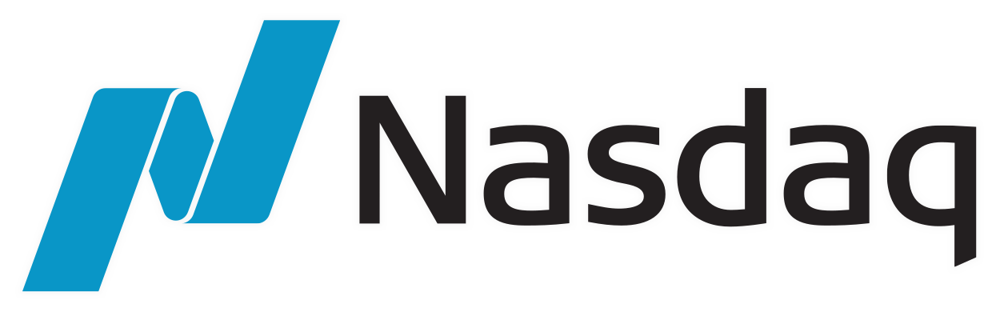

</img>
# 
Stock Analysis Of The Biggest Tech Companies (And the SP500)

### Overview

The objective of this repository is to analyze the six biggest companies listed on the Nasdaq and the S&P 500 ETF known as SPY. The analyzed companies are Apple, Microsoft, Alphabet, Amazon, Nvidia, and Tesla. I have exclusively used Python and Jupyter Notebook to create all of my visualizations and insights, which are presented in the Nasdaq Analysis.ipynb file.

### Prerequisites
To fully understand the process and the concepts used for this project, I would recommend to have a good understanding of:
- Python and Jupyter Notebook
- The Python Libraries Pandas, Numpy, Matplotlib, YFinance, and Seaborn
